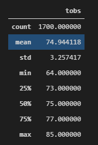
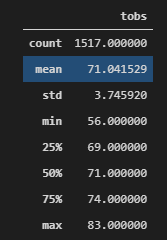

# Surfs_Up_Analysis
# Analysis of Statistical Data
> Summary of statistical data from SQLite database of Hawaii weather using SQLAlchemy, Python, and Pandas. 

## Overview of Statistical Analysis
> Analysis of temperature trends from June and December in Oahu, Hawaii.   

### Results
> Statistical Summary of Temperature Data

    - Temperatures in Oahu are mild year round with a min temp of 56 degrees in December and a max temp of 85 degrees in June.

    - The average temperature in June and December only varies by 3 degrees, from 71 in December to 74 in June.  

    - The minimum temperature has a greater variation with a difference 8 degrees between June and December compared to the maximum temperature which only varies by 2 degrees. 

## Summary
> The weather in Oahu is temperate year round. With highs in the 80s and lows in the 50s and averages in the 70s all year. The location is optimal for both ice cream and surfing and we should all move there immediately.